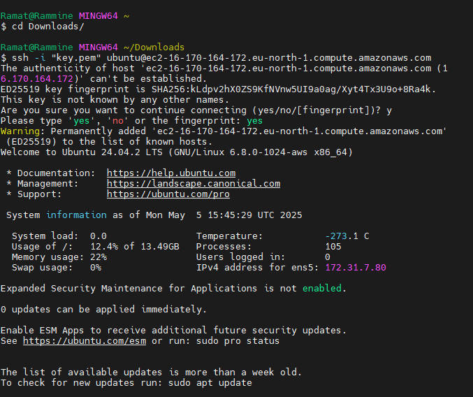

# linux-project

## Those are project on EC2 AWS using linux base experiences.
 ### Those are example showing connectivity on AWS using mobaxterm as a client tools

 

 

 

 

 

 

 

 

 

 

 

 

 

 

 

 
 